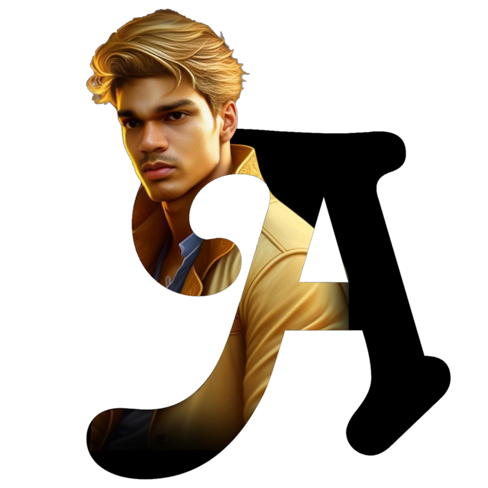
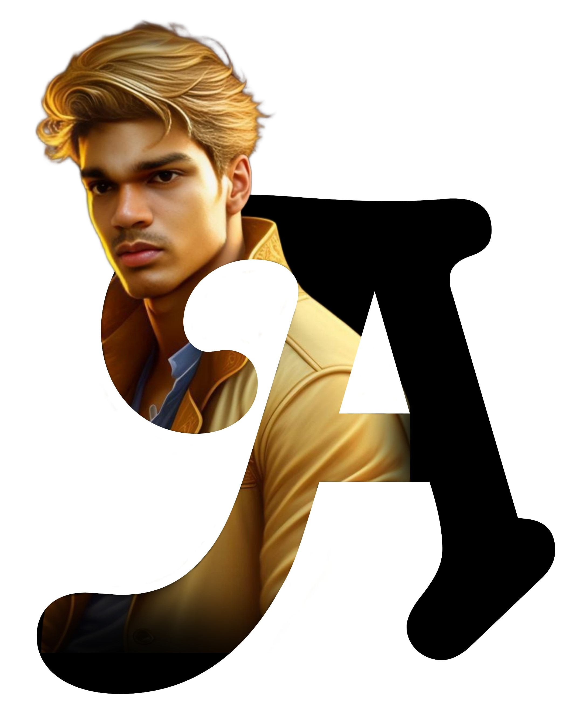
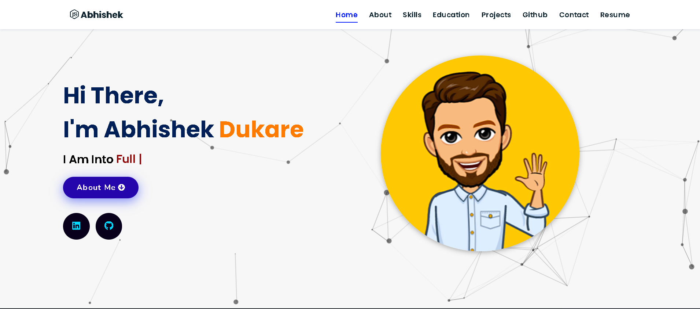
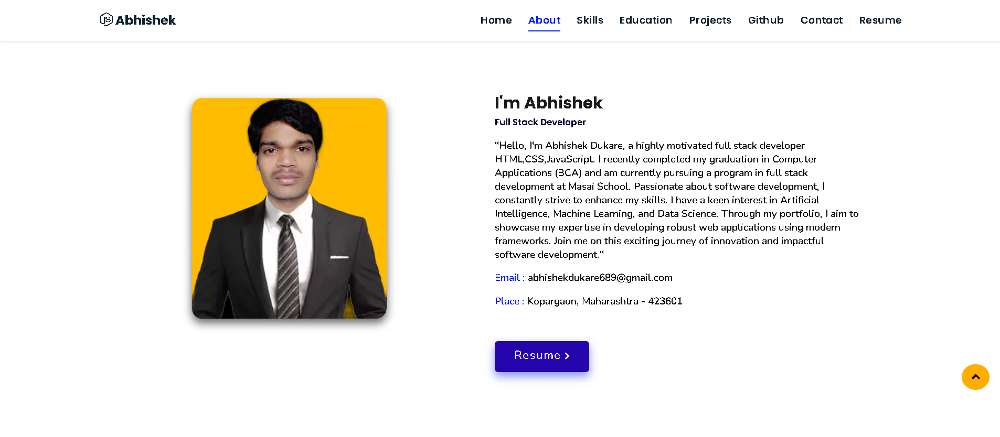
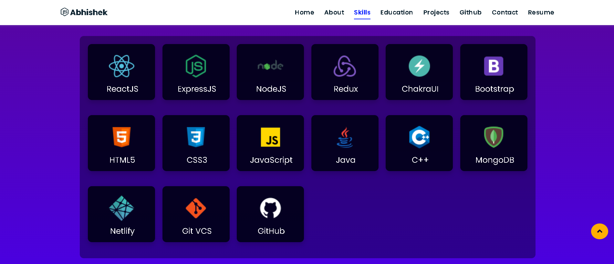
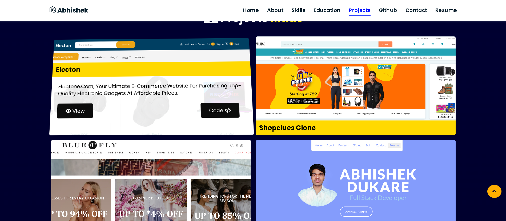
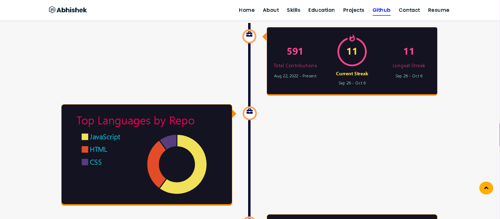
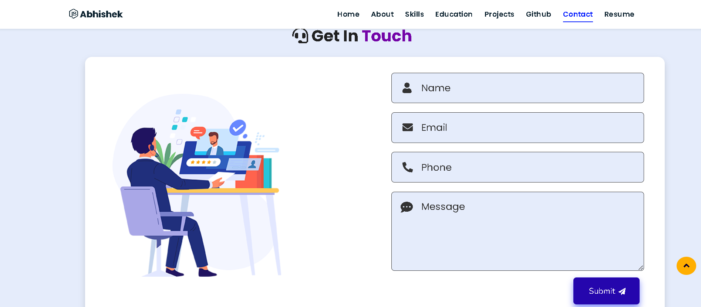

# Portfolio

Welcome to my portfolio! Here, I proudly present my skills, accomplishments, and creative journey in the field of development. This collection is a reflection of my unwavering passion for the craft and my continuous pursuit of excellence.

<!--  -->
## Introduction

Greetings! I am thrilled to share my development journey with you through this portfolio. I have dedicated myself to honing my skills, embracing challenges, and delivering innovative solutions. This portfolio serves as a testament to my commitment to excellence and my passion for continuous learning.

## Skills

- Web Development (HTML, CSS, JavaScript, React, etc.)
- Backend Development (Node.js, Express, etc.)
- Database Management ( MongoDB,Mongoose )
- Version Control (Git, GitHub)
- Problem Solving and Algorithmic Thinking

## Projects

### Project 1: Bluefly Clone
Our Bluefly.com website clone is a meticulously crafted online fashion retail platform inspired by the popular original. It offers a wide selection of designer clothing, accessories, and home decor products at competitive prices. With a user-friendly interface, customers can easily navigate through various categories, explore top designer brands, and discover discounted luxury fashion items.

### Project 2: Shopclues Clone
Welcome to ShopClues Clone, a meticulously crafted e-commerce platform that brings you the essence of India's leading online shopping website, ShopClues.com. With our clone, we strive to provide you with a seamless shopping experience that rivals the original.

### Project 3: Electon
Electone.Com, Your Ultimate E-Commerce Website For Purchasing Top-Quality Electronic Gadgets At Affordable Prices.

## Contact

I would love to connect with you and discuss collaboration opportunities or answer any questions you might have. Feel free to reach out to me through the following channels:

- Email: abhishekdukare689@gmail.com
- LinkedIn: (https://www.linkedin.com/in/abhishek-dukare-937156257)
- Portfolio Website: (https://github.com/abhi21121211/abhi21121211.github.io)

Thank you for taking the time to explore my portfolio. I look forward to the possibility of working together and contributing to exciting projects.

#abhishekdukareportfolio
#portfolio #masai #abhishek #dukare #fullstackdevlper #webdevlper 